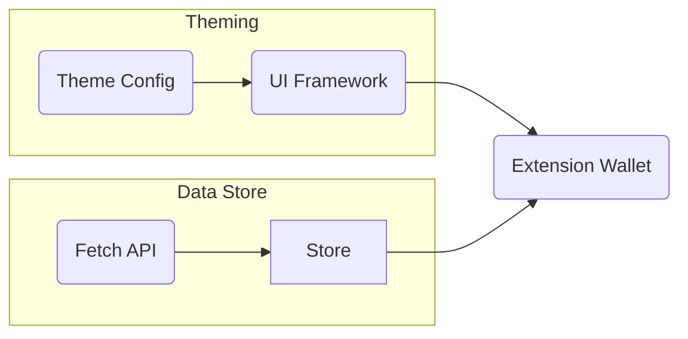
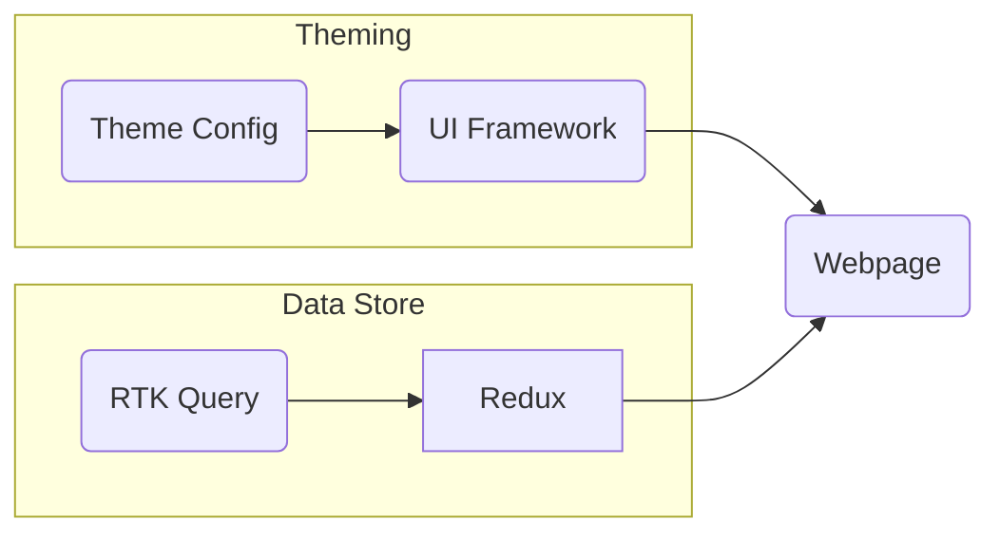
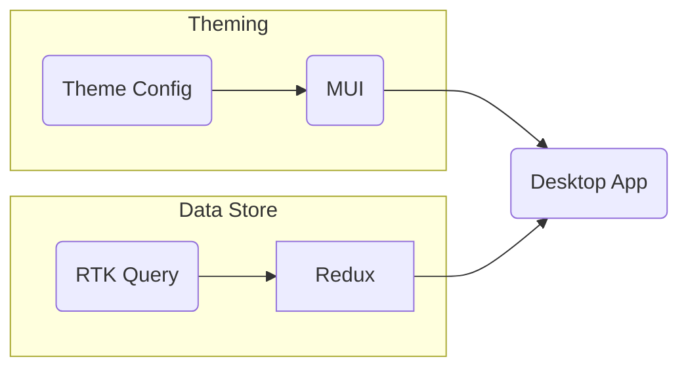
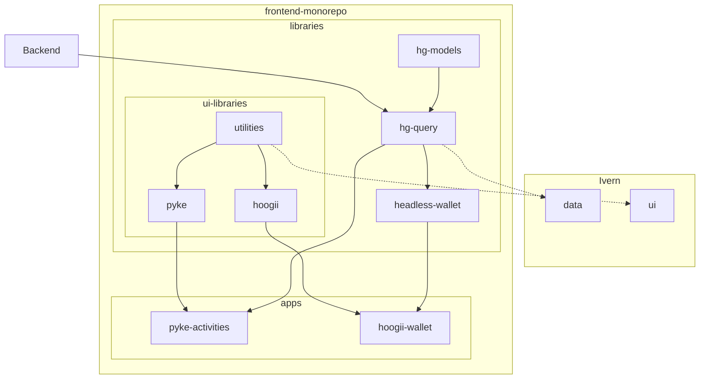

# Monorepo

The Silver Bullet for Software Development!?

---
hideInToc: true
---

## Outlines

<Toc minDepth='2' />

---
layout: image-right
image: https://monorepo.tools/images/monorepo-polyrepo.svg
class: flex flex-col
---

## What's monorepo

A single repository containing multiple distinct projects, with well-defined relationships.

- Detecting affected projects/packages
- ability to run tasks in the correct order and in parallel
- Consistent tooling

> reference: [Misconceptions about Monorepos: Monorepo != Monolith](https://blog.nrwl.io/misconceptions-about-monorepos-monorepo-monolith-df1250d4b03c)

---
layout: two-cols
---

## Why use monorepo?

### Pros:

- 共享程式碼與資源
- 簡化部署與維護
- 提高協作效率

### Cons:

- 增加 Repository 複雜度

::right::

## Why use polyrepo?

### Pros:

- 專案單純易懂
- 技術選擇獨立
- 專案間相依定義明確：版號

### Cons:

- 重工
- CI/CD 各專案各自設定，更動成本高

---
layout: image-right
image: /images/monorepos-tools.png
---
## [Nx](https://nx.dev)
Next generation build system with first class monorepo support and powerful integrations.

- 提高開發效率
  - Project Generator
  - Task Executor
  - 根據需求可客制專案模板？
- 提高可維護性
  - 使用命名約定來提高代碼的可讀性
  - 使用 linters 和型別檢查來提高代碼質量
- 提高可測試性
  - Unit, Integration, E2E Tests
  - 自動化測試流程
  - 對依賴的專案重新測試

[reference](https://monorepo.tools/#tools-review)

---
layout: two-cols
---

### [Generators, Executors](https://nx.dev/nx-api)

1. Official
2. Communities
    - [Local Generators](https://nx.dev/extending-nx/recipes/local-generators)(Expensive)
    - [Local Executors](https://nx.dev/extending-nx/recipes/local-executors)(Expensive)
3. [nx:run-commands](https://nx.dev/nx-api/nx/executors/run-commands)

::right::

### Testing

- Unit Tests：對 libraries
  - Jest
  - Vitest
- Integration Tests: 
- E2E Tests: 對 apps
  - Playwright
  - Cypress

### [Caching](https://nx.dev/concepts/how-caching-works)

- Local Caching
  - 提升個人開發效率
- Remote Caching
  - 提升組織開發效率
  - 降低CI成本

---

## [frontend-monorepo](https://github.com/hashgreen/frontend-monorepo)

<Iframe :fallback="{src: '/images/pyke-monorepo-graph.png', alt: 'pyke-monorepo-graph'}" />

#### Libraries

<table>
  <tbody>
    <tr>
      <td>hg-models</td>
      <td>data classes</td>
    </tr>
    <tr>
      <td>hg-query</td>
      <td>data fetching e.g. Fetch API, SWR, RTK Query</td>
    </tr>
    <tr>
      <td>headless-wallet</td>
      <td>headless chia wallet</td>
    </tr>
    <tr>
      <td>ui-libraries</td>
      <td>utilities, hoogii, pyke</td>
    </tr>
    <tr>
      <td>wallet-connect</td>
      <td>hoogii, goby</td>
    </tr>
  </tbody>
</table>

#### Apps
- pyke-activities
- wallet-prompt-tools
- devtools
- extension-wallet

#### Tests
- pyke-frontend: 
  - e2e test on stg
- wallet-connect-e2e: 
  - integration tests for wallet-connect

---
layout: two-cols
---

### Case Study - Pyke, Hoogii and Ivern - Before

#### Hoogii

#### Pyke

::right::

#### Ivern

#### 共通項目
- Theming: 
  - 色票、字型設定
  - 常用功能的 CSS classes
- Data Store:
  - 資料拿取的網址、傳輸的資料
  - 取得資料後的後處理

---

### Case Study - Pyke, Hoogii and Ivern - After

---

## Discussion

1. js/ts bundler 扮演專案間接合劑; ts compiler 做 bundlers 間的縫合; linters 作為其中的約束器
  - Vite
  - Webpack/Turbopack
  - `tsconfig.base.json`: 設定全域模組引入
  - `/.eslintrc.json`: 限制模組依賴
2. 程式碼歸屬、存取修改權限的限制
3. 版號控制、CI/CD 效率提升
  - libraries
    - workflow_dispatch
    - 改動偵測、利用 dependencies graph 達到有效率的自動化部屬
  - apps
    - containerize
    - 結案、維運的專案的封存機制
